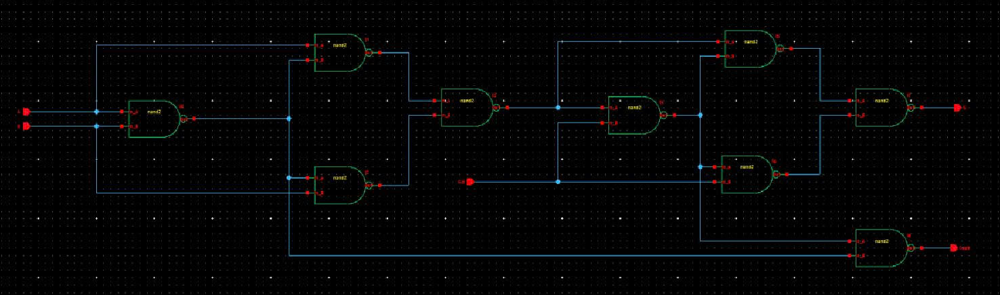
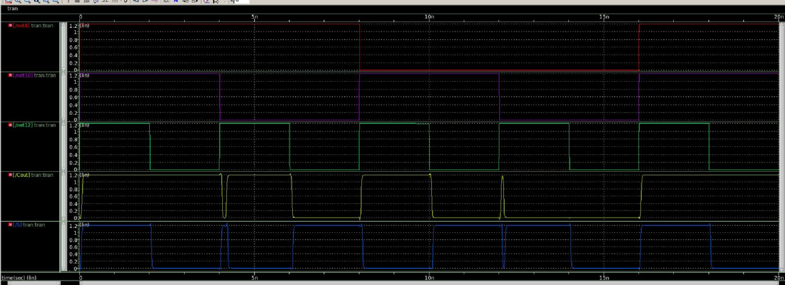
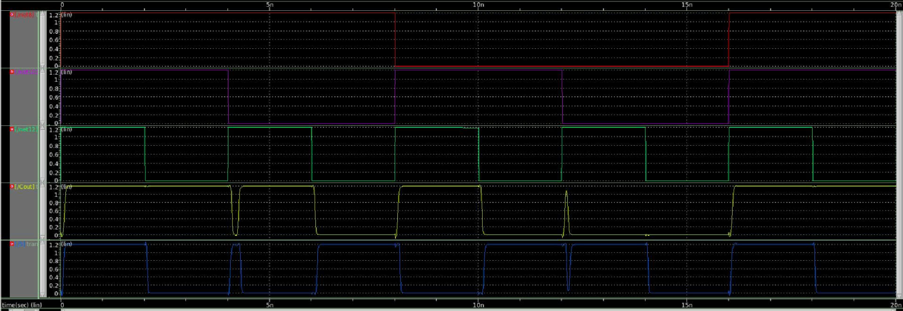

# CMOS Full Adder Design using NAND2 Gates in Synopsys Custom Designer (90nm Technology)

## 📌 Overview

This project presents the complete custom CMOS Full Adder design implemented entirely using **NAND2 gates** in **Synopsys Custom Designer** with **90nm CMOS technology**.

The project covers the full IC design flow:

* Logic design using NAND2 gates
* Schematic implementation
* Pre-layout simulation
* Full custom layout design
* DRC/LVS verification
* Post-layout parasitic analysis (LPE)

---

## 🎯 Objectives

* Design a 1-bit CMOS Full Adder using only NAND2 gates
* Implement transistor-level CMOS logic in 90nm technology
* Verify physical correctness using DRC and LVS
* Analyze the impact of parasitic effects after layout extraction

---

## 🛠 Design Environment

* **EDA Tool:** Synopsys Custom Designer
* **Technology Node:** 90nm CMOS
* **Logic Style:** Static CMOS NAND2-based implementation
* **Simulation:** SPICE Simulation
* **Verification:** DRC / LVS / LPE

---

## 🧠 Logic Design

The Full Adder was constructed entirely from NAND2 gates.

### Boolean Functions

* Sum = A ⊕ B ⊕ Cin
* Cout = AB + Cin(A ⊕ B)

The XOR and carry logic were decomposed into NAND2-based CMOS implementations.

---

## 🔌 Schematic Design

The transistor-level schematic was implemented using CMOS NAND2 cells interconnected to realize the Full Adder logic.

### Schematic

---

## 📊 Pre-Layout Simulation

Functional verification and timing analysis were performed before layout generation.

### Waveform

### Verification

* Correct SUM output
* Correct COUT output
---

## 🧱 Layout Design

The layout was manually designed in Synopsys Custom Designer following 90nm CMOS design rules.

### Layout

### Layout Features

* Hierarchical NAND2-based structure
* Shared diffusion optimization
* Compact transistor placement
* Reduced routing complexity
* Metal interconnect optimization

---

## ✅ Physical Verification

### DRC (Design Rule Check)

The layout successfully passed all DRC checks.

---

### LVS (Layout Versus Schematic)

The extracted layout matched the original schematic successfully.

---

## ⚡ Post-Layout Extraction (LPE)

Parasitic extraction was performed to evaluate layout-induced effects on timing and signal integrity.

### Post-Layout Simulation

### Observation

* Increased propagation delay after extraction
* Additional parasitic capacitance observed
* Slight degradation in switching performance

---

## 📌 Key Learnings

* CMOS Full Adder implementation using universal NAND2 gates
* Hierarchical digital circuit design
* Full custom layout methodology
* Physical verification flow (DRC/LVS)
* Impact of parasitic extraction on timing performance
---

## 🚀 Future Improvements

* Reduce transistor count
* Optimize propagation delay
* Compare NAND-only implementation with XOR-based architectures
* Analyze power-delay trade-offs
